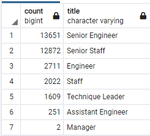
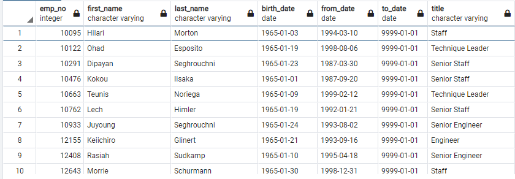

# Pewlett-Hackard-Analysis
## Purpose
Help Bobby's manager for the "silver tsunami" as current employees reach retirement age by determining the number of retiring employees per title and identifying employees who are eligible to participate in the mentorship program!

## Analysis Results
### Dependencies
Using SQL, we use various SQL queries to select, group, join, and various other functions to the tables given by Bobby's manager and those we worked on in the module.
__Files including:__
- current_emp.csv
- current_emp_dept.csv
- department.csv
- dept_emp.csv
- dept_manager.csv
- emp_info.csv
- employees.csv
- salaries.csv
- titles.csv

### Queries
Our first deliverable, we made two queries to output a csv file created using the **current_emp.csv** we obtained during the module and the **titles_csv** provided from Bobby's manager, called **unique_titles.csv**. The unique_titles.csv contains information including our current employees' numbers, their first and last name, their __most recent__ title, and employment dates. Then we summed up the number of employees by their titles and output the table in the **retiring_titles.csv**(below).

In the second deliverable, we made a query to find eligible employees for the mentorship program by joining the **dept_emp.csv** and **titles.csv** with the **employees.csv** to generate the following (sneakpeak) **mentorship.csv** table:

Here are four major points from the analysis above:
- The numbers of employees nearing retirement age is staggering. Around 33,000 employees need to be replaced.
- The number of Senior Engineer and Senior Staff outweigh the amount of regular Engineer and Staff.
- Bright side, only two Managers are needing to be replaced contrasting the roughly 26,000 Senior Engineers/Staff.
- There are 1549 employees who are eligible for the mentorship program.

## Summary
Although the number of employees we generated is staggering, totalling 33,118 employees, it doesn't mean they will all retire together in the imminent future. Using the 1549 employees who are eglible for mentorship, the company should consider starting the program in the near future. Taking a quick look at the **mentorshiop_eligibility** table, we can see that there are many employees in the Senior status, so we can consider them to mentor the next set of Senior Engineers/Staffs and regular Engineers/Staffs simultaneously. 

### Next Step
Now that we have obtained the number of employees who may be retiring soon. We can make a query to find the number of Senior Engineers/Staffs eligible for mentorship and regular Engineers/Staffs from the retiring employees to find a balanced ratio of mentors to employees for the planning of the mentorship program.
